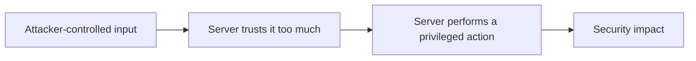
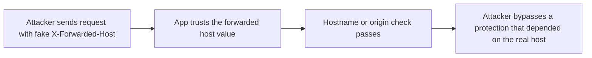
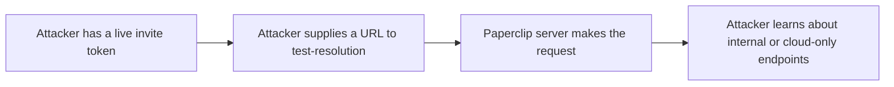
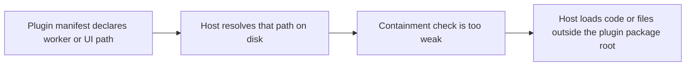

# Founder-Friendly Security Audit Walkthrough

This note explains the first-pass security language from issue `#9` in plain English:

> "I’ve confirmed the highest-risk application code paths are still where I expected: host-header trust, invite probe SSRF, skill-file writes, and plugin path confinement."

The goal is to make that sentence understandable if you are reading an audit for the first time.

## The Simple Mental Model

In a security review, I am usually asking four questions:

1. What input can an outside user control?
2. What privileged thing does the server do with that input?
3. Does that cross a trust boundary?
4. If it goes wrong, what is the damage?

Most serious application bugs fit a pattern like this:

The four areas I called out are all examples of that pattern.

## A Few Terms In Plain English

- `Untrusted input`: anything a browser, API client, plugin, or invite-holder can send to the server.
- `Trust boundary`: the line between what the server should assume is safe and what it should verify first.
- `Privileged action`: something the server can do that a normal outside user cannot do directly, like reading internal files or making internal network requests.
- `Containment`: making sure a file path or plugin path stays inside its allowed directory.

## 1. Host-Header Trust

### What this means

When a browser calls a website, it sends headers that say which hostname it asked for. The important ones here are:

- `Host`
- `X-Forwarded-Host`

Apps often use those values for:

- generating URLs
- checking whether a hostname is allowed
- checking whether a browser request came from a trusted origin

### Why this can be dangerous

If the app trusts `X-Forwarded-Host` directly from the client, an attacker can sometimes lie about which hostname they used.

That becomes dangerous when the app uses that header to decide:

- "is this request allowed?"
- "does this request look like it came from my trusted domain?"
- "what URL should I generate for this user?"

### The Paperclip-specific example

In this codebase, this pattern appears in:

- `server/src/middleware/private-hostname-guard.ts`
- `server/src/middleware/board-mutation-guard.ts`
- `server/src/routes/access.ts`

Those places use forwarded host information in ways that affect security decisions.

If a deployment does not have a properly configured trusted proxy boundary, a client can send a fake `X-Forwarded-Host` header and the app may believe it.

### Real-world version of the bug

### Why I checked this early

This kind of issue is common in apps behind reverse proxies, load balancers, or tunnels. It is easy for teams to assume that a forwarded header is always trustworthy, but that is only true if the proxy boundary is explicitly configured and enforced.

### What the practical risk is

In Paperclip, the risk is not "the whole app instantly falls over." The risk is more subtle:

- private-hostname restrictions can be weakened
- trusted browser-origin checks can be weakened
- generated links can be influenced by attacker-controlled host data

### Founder takeaway

This is a "the app is trusting infrastructure metadata too early" problem.

That is why I made it a top-priority follow-up issue: [#12](https://github.com/lunr-studio/paperclip/issues/12).

## 2. Invite Probe SSRF

### What SSRF means

SSRF stands for `Server-Side Request Forgery`.

Plain English:

- the attacker gives your server a URL
- your server makes a network request to that URL
- your server can often reach places the attacker cannot

That is dangerous because the server is now acting as a network client on the attacker’s behalf.

### The Paperclip-specific example

Paperclip has an invite-related endpoint that accepts a URL and performs a server-side `HEAD` request to test it:

- `server/src/routes/access.ts`
- route: `GET /api/invites/:token/test-resolution`

Even though it only uses `HEAD`, that still matters.

### Why `HEAD` is still risky

A `HEAD` request can still tell an attacker:

- whether an internal service exists
- whether it is reachable
- how quickly it responds
- which status code it returns

That is enough to map internal infrastructure.

### Real-world version of the bug

### Why this matters so much in cloud deployments

A cloud VM can usually reach things that the public internet cannot, for example:

- `localhost`
- private `10.x.x.x` addresses
- link-local services
- cloud metadata endpoints

So even a "tiny" probe endpoint can become an internal discovery tool.

### Founder takeaway

This is a real security issue, not just "something to clean up later."

That is why I opened [#11](https://github.com/lunr-studio/paperclip/issues/11) as one of the top remediation items.

## 3. Skill-File Writes

### What this means

Paperclip has features that let the app read and update skill files on disk.

That means the server is taking:

- a file path
- file contents

and then writing to the filesystem.

### Why file writes are always worth checking

Whenever users can influence a file path, I immediately ask:

- can they escape the intended directory?
- can they overwrite something sensitive?
- can they plant an executable or config file?
- can they make the app trust a file it should not trust?

### The Paperclip-specific example

This area lives mainly in:

- `server/src/services/company-skills.ts`

The code does normalize incoming portable paths, which is good. That means a simple `../../` path traversal is much harder here than in an unprotected implementation.

### So why did I still mention it?

Because it is a high-risk category even when a specific critical exploit is not immediately confirmed.

A first-pass audit should always inspect file-write surfaces because they are one of the classic places where bugs become serious quickly.

### Important nuance

For this audit, this category did **not** become one of the top confirmed security findings.

Instead, it was an example of:

- a risky area I checked early
- a surface that still deserves caution
- a place where correctness and inventory consistency issues were already visible

So when I said I checked "skill-file writes," I meant:

"this is one of the first sensitive filesystem boundaries I audited."

### Founder takeaway

Not every high-risk category turns into a critical finding. Good auditing means checking these areas first anyway.

## 4. Plugin Path Confinement

### What this means

Plugins tell Paperclip where their worker code and UI files live.

That sounds harmless, but it becomes dangerous if a plugin can point outside its own package directory.

### Why that matters

If plugin paths are not tightly confined, a malicious plugin may try to:

- load code from a sibling directory
- serve files from outside its package
- escape the intended plugin root entirely

### The Paperclip-specific example

I reviewed:

- `server/src/services/plugin-loader.ts`
- `server/src/routes/plugin-ui-static.ts`

The current code does try to defend against traversal, but it relies on string-prefix checks that are more brittle than they should be.

### Real-world version of the bug

### Why this matters less than SSRF or host-header trust

This usually requires a malicious or compromised plugin package, so the attacker model is a bit narrower.

That is why I treated it as important but not the very first thing to fix.

### Founder takeaway

This is a plugin sandboxing problem.

That became follow-up issue [#13](https://github.com/lunr-studio/paperclip/issues/13).

## Why These Four Were The First Places I Looked

These are all places where untrusted input reaches something powerful:

- headers -> security decisions
- URLs -> server-side network access
- file paths -> disk writes
- plugin entrypoints -> code loading or file serving

That is the pattern.

If I am auditing quickly but carefully, I start with:

1. network access
2. auth and origin checks
3. filesystem writes
4. dynamic code loading

Paperclip has all four of those categories, so those became the first inspection targets.

## How To Read The Priorities

- `P1`: real security issue that should be fixed soon
- `P2`: meaningful risk or hardening gap, but not the most urgent thing in the system

For this audit, the highest-value next fixes are:

1. [#11](https://github.com/lunr-studio/paperclip/issues/11) SSRF hardening
2. [#12](https://github.com/lunr-studio/paperclip/issues/12) host-header trust hardening
3. [#14](https://github.com/lunr-studio/paperclip/issues/14) deployment hardening
4. [#13](https://github.com/lunr-studio/paperclip/issues/13) plugin path confinement

## If You Are Reading This As A Founder

The simplest summary is:

- I first looked at whether the app trusts request metadata too much
- then whether it can be tricked into making internal network requests
- then whether it can be tricked into writing files
- then whether plugins can escape their own directory boundaries

That is why that original sentence used those four categories. They are the fastest way to inspect the parts of an application where security bugs most often become expensive.
